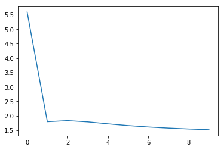

# pytorch-Radical-CNN-RNN
A pytorch implementation of Radical-level Ideograph Encoder for RNN-based Sentiment Analysis of Chinese and Japanese
## Requirement
* numpy
* pytorch >=0.4
* jaconv(https://github.com/ikegami-yukino/jaconv)
* janome(http://mocobeta.github.io/janome/)
## Usage
See Radicals-CNN-RNN_Demo.ipynb

## About the Character Information Database
We used CHISE: http://www.chise.org/ids/
## Reference
```
@article{ke2018cnn,
  title={CNN-encoded radical-level representation for Japanese processing},
  author={Ke, Yuanzhi and Hagiwara, Masafumi},
  journal={Transactions of the Japanese Society for Artificial Intelligence},
  volume={33},
  number={4},
  pages={D--I23},
  year={2018},
  publisher={The Japanese Society for Artificial Intelligence}
}
```
